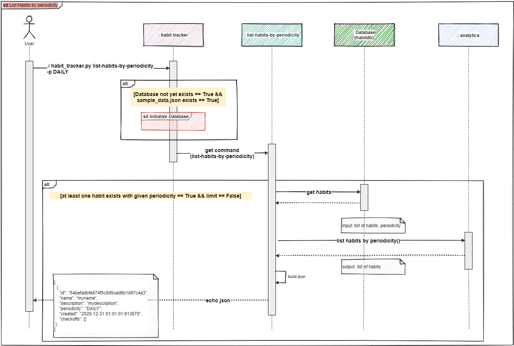

# \*\~HaTraBa\~\* Version 1.0.0
A basic CLI-based **Ha**bit **Tra**cking **Ba**ckend.

(Developed in the course of a portfolio task for my study at IUBH).

## Table of Contents

- [HaTraBa in a nutshell](#hatraba-in-a-nutshell)
- [Supported basic functionality scenarios](#supported-basic-functionality-scenarios)
- [Setup Guide](#setup-guide)
    - [Prerequisites](#prerequisites)
    - [Installation](#installation)
- [Run test cases](#run-test-cases)
- [Usage Guide](#usage-guide)
    - [Overview of Commands](#overview-of-commands)
    - [Management of Habits](#management-of-habits)
        - [create](#create)
        - [checkoff](#checkoff)
        - [delete](#delete)
    - [Analytics of Habits](#analytics-of-habits)
        - [list-habits](#list-habits)
        - [list-habits-by-periodicity](#list-habits-by-periodicity)
        - [get-longest-streak](#get-longest-streak)
        - [get-longest-streak-for-habit](#get-longest-streak-for-habit)
- [Behind the scenes](#behind-the-scenes)
    - [Components](#components)
    - [Process Create Habit](#process-create-habit)
    - [Process Checkoff Habit](#process-checkoff-habit)
    - [Process Delete Habit](#process-delete-habit)
    - [Process List Habits](#process-list-habits)
    - [Process List Habits by periodicity](#process-list-habits-by-periodicity)
    - [Process Get longest Streak](#process-get-longest-streak)
    - [Process Get longest Streak for Habit](#process-get-longest-streak-for-habit)
- [License](#license)


## HaTraBa in a nutshell

* Habit tracking backend that enables human users as well as system users (e.g. technical clients with an user interface to a human user) to manage and analyze habits.
* Command line interface application where users interact entirely through their terminal.
* Accepts a set of commands and returns JSON output per default which can be further processed by the user. In addition and if desired, a more human readable output format can be forced. 
* “Ready-to-use” with 5 predefined habits and example tracking data for period of one month.

## Supported basic functionality scenarios


## Setup Guide

### Prerequisites
Python 3.8.3 or later

### Installation
Note: Installation routine under Windows 10 is described here. 
Please adapt shell commands in case of you're running another operating system.

(1) Download the development version (current master is V1.0.0) to any wished location

https://github.com/anjakuchenbecker/oofpp_habits_project/archive/main.zip

(2) Open the `cmd` and go to the download location

(3) Unzip the downloaded file
``` sh
$ tar -xf oofpp_habits_project-main.zip
```

(4) Switch to `oofpp_habits_project-main` folder
``` sh
$ cd oofpp_habits_project-main
```

(5) Create virtual environment
``` sh
$ python -m venv env
```

(6) Activate virtual environment
``` sh
$ .\env\Scripts\activate
```

(7) Install requirements

``` sh
(env) $ pip install -r requirements.txt
```

(8) Switch to `habittracker` folder

``` sh
(env) $ cd habittracker
```

(9) Perform a tiny smoke test
``` sh
(env) $ python habit_tracker.py
```

You should see something like this


Installation procedure is finished. 

Now, you can 
- [Run the test cases](#run-test-cases), to check whether everything is ok
- or directly start using HaTraBa, please refer to the [Usage Guide](#usage-guide)

## Run test cases

(1) Ensure that you are in the `habittracker` folder

(2) Run tests

``` sh
(env) $ pytest ../tests
```

(3) You should now see something like this


## Usage Guide

Ensure that you are in the `habittracker` folder, before you running commands!

The general usage pattern is:

``` sh
(env) $ python habit_tracker.py [OPTIONS] COMMAND [ARGS]
```

Use `python habit_tracker.py COMMAND --help` for information on a specific command.

### Overview of commands

The following commands are supported:                   
                                             
 <table>
  <tr>
    <th>Command</th>
    <th>Description</th>
    <th>Category</th>
  </tr>
  <tr>
    <td>create</td>
    <td>Create habit with given details.</td>
    <td>Management of habits</td>
  </tr>
  <tr>
    <td>checkoff</td>
    <td>Check off given habit.</td>
    <td>Management of Habits</td>
  </tr>
  <tr>
    <td>delete</td>
    <td>Delete given habit.</td>
    <td>Management of Habits</td>
  </tr>
  <tr>
    <td>list-habits</td>
    <td>Return a list of all currently tracked habits.</td>
    <td>Analytics of Habits</td>
  </tr>
  <tr>
    <td>list-habits-by-periodicity</td>
    <td>Return a list of all currently tracked habits filtered according to given periodicity.</td>
    <td>Analytics of Habits</td>
  </tr>
  <tr>
    <td>get-longest-streak</td>
    <td>Return the longest streak of all currently tracked habits.</td>
    <td>Analytics of Habits</td>
  </tr>
  <tr>
    <td>get-longest-streak-for-habit </td>
    <td>Return the longest streak for the given habit.</td>
    <td>Analytics of Habits</td>
  </tr>
</table> 

Please refer to the subsequent chapters to get more details for each command.

### Management of Habits
#### create

---
##### Description
Creates a habit with given details and returns created habit. 

##### Options
 <table>
  <tr>
    <th>Option</th>
    <th>Description</th>
    <th>Required</th>
  </tr>
  <tr>
    <td>-n, --name TEXT</td>
    <td>Name of habit.</td>
    <td>Yes</td>
  </tr>
  <tr>
    <td>-d, --description TEXT</td>
    <td>Description of habit.</td>
    <td>Yes</td>
  </tr>
  <tr>
    <td>-p, --periodicity [DAILY|WEEKLY]</td>
    <td>Periodicity of habit.</td>
    <td>Yes</td>
  </tr>
  <tr>
    <td>-o, --output [JSON|HUMAN]</td>
    <td>Output format. Default JSON.</td>
    <td>No</td>
  </tr>
  <tr>
    <td>--help</td>
    <td>Show this message and exit.</td>
    <td>No</td>
  </tr>
</table>

##### Output
JSON Document, per default. 

(Use option `-o HUMAN` to force a more human readable output format.)

 <table>
  <tr>
    <th>Element</th>
    <th>Type</th>
    <th>Description</th>
  </tr>
  <tr>
    <td>id</td>
    <td>string</td>
    <td>Unique identifier of the habit.</td>
  </tr>
  <tr>
    <td>name</td>
    <td>string</td>
    <td>Name of the habit.</td>
  </tr>
  <tr>
    <td>description</td>
    <td>string</td>
    <td>Description of the habit.</td>
  </tr>
  <tr>
    <td>periodicity</td>
    <td>string</td>
    <td>Periodicity of the habit.</td>
  </tr>
  <tr>
    <td>created</td>
    <td>string</td>
    <td>Creation timestamp of the habit.</td>
  </tr>
  <tr>
    <td>checkoffs</td>
    <td>array</td>
    <td>List of all check offs.</td>
  </tr>
</table>


##### Example
Command
``` sh
(env) $ python habit_tracker.py create -n "name" -d "desc" -p DAILY
```
Output
``` sh
{
"id": "54befadbfe874f5c9d5cad6b1d67c4a3",
"name": "name",
"description": "description",
"periodicity": "DAILY",
"created": "2021-01-01 01:01:01.418133",
"checkoffs": []
}
```

#### checkoff

---
##### Description
Checks off given habit with given timestamp and returns checked off habit.

##### Options
 <table>
  <tr>
    <th>Option</th>
    <th>Description</th>
    <th>Required</th>
  </tr>
  <tr>
    <td>-h, --habit-id TEXT</td>
    <td>Id of habit that has to be checked off.</td>
    <td>Yes</td>
  </tr>
  <tr>
    <td>-t, --timestamp TEXT</td>
    <td>Check off timestamp, format YYYY-MM-DD HH:MM:SS.f.</td>
    <td>Yes</td>
  </tr>
  <tr>
    <td>-o, --output [JSON|HUMAN]</td>
    <td>Output format. Default JSON.</td>
    <td>No</td>
  </tr>
  <tr>
    <td>--help</td>
    <td>Show this message and exit.</td>
    <td>No</td>
  </tr>
</table>

##### Output
JSON Document, per default. 

(Use option `-o HUMAN` to force a more human readable output format.)

 <table>
  <tr>
    <th>Element</th>
    <th>Type</th>
    <th>Description</th>
  </tr>
  <tr>
    <td>id</td>
    <td>string</td>
    <td>Unique identifier of the habit.</td>
  </tr>
  <tr>
    <td>name</td>
    <td>string</td>
    <td>Name of the habit.</td>
  </tr>
  <tr>
    <td>description</td>
    <td>string</td>
    <td>Description of the habit.</td>
  </tr>
  <tr>
    <td>periodicity</td>
    <td>string</td>
    <td>Periodicity of the habit.</td>
  </tr>
  <tr>
    <td>created</td>
    <td>string</td>
    <td>Creation timestamp of the habit.</td>
  </tr>
  <tr>
    <td>checkoffs</td>
    <td>array</td>
    <td>List of all check offs.</td>
  </tr>
</table>

##### Example
Command
``` sh
(env) $ python habit_tracker.py checkoff –h 54befadbfe874f5c9d5cad6b1d67c4a3 –t "2021-01-02 14:00:01.518133"
```
Output
``` sh
{
"id": "54befadbfe874f5c9d5cad6b1d67c4a3",
"name": "name",
"description": "description",
"periodicity": "DAILY",
"created": "2020-12-31 01:01:01.418133",
"checkoffs": [
    "2021-01-02 14:00:01.518133"
    ]
}
```

#### delete

---
##### Description
Deletes given habit and returns id of deleted habit.

##### Options
 <table>
  <tr>
    <th>Option</th>
    <th>Description</th>
    <th>Required</th>
  </tr>
  <tr>
    <td>-h, --habit-id TEXT</td>
    <td>Id of habit that has to be deleted.</td>
    <td>Yes</td>
  </tr>
  <tr>
    <td>-o, --output [JSON|HUMAN]</td>
    <td>Output format. Default JSON.</td>
    <td>No</td>
  </tr>
  <tr>
    <td>--help</td>
    <td>Show this message and exit.</td>
    <td>No</td>
  </tr>
</table>

##### Output
JSON Document, per default. 

(Use option `-o HUMAN` to force a more human readable output format.)

 <table>
  <tr>
    <th>Element</th>
    <th>Type</th>
    <th>Description</th>
  </tr>
  <tr>
    <td>id</td>
    <td>string</td>
    <td>Unique identifier of the habit.</td>
  </tr>
</table>

##### Example
Command
``` sh
(env) $ python habit_tracker.py delete –h 54befadbfe874f5c9d5cad6b1d67c4a3
```
Output
``` sh
{
"id": "54befadbfe874f5c9d5cad6b1d67c4a3"
}
```

### Analytics of Habits
#### list-habits

---
##### Description
Returns a list of all currently tracked habits.

The habits are returned sorted by creation date, with the most recently created habit appearing first.

##### Options
 <table>
  <tr>
    <th>Option</th>
    <th>Description</th>
    <th>Required</th>
  </tr>
  <tr>
    <td>-l, --limit INTEGER</td>
    <td>A limit on the number of objects to be returned, must be positive. Default is no limit.
    </td>
    <td>No</td>
  </tr>
  <tr>
    <td>-o, --output [JSON|HUMAN]</td>
    <td>Output format. Default JSON.</td>
    <td>No</td>
  </tr>
  <tr>
    <td>--help</td>
    <td>Show this message and exit.</td>
    <td>No</td>
  </tr>
</table>

##### Output
JSON Document, per default. 

(Use option `-o HUMAN` to force a more human readable output format.)

List (array) of habit objects, each of the following element:
 <table>
  <tr>
    <th>Element</th>
    <th>Type</th>
    <th>Description</th>
  </tr>
  <tr>
    <td>id</td>
    <td>string</td>
    <td>Unique identifier of the habit.</td>
  </tr>
  <tr>
    <td>name</td>
    <td>string</td>
    <td>Name of the habit.</td>
  </tr>
  <tr>
    <td>description</td>
    <td>string</td>
    <td>Description of the habit.</td>
  </tr>
  <tr>
    <td>periodicity</td>
    <td>string</td>
    <td>Periodicity of the habit.</td>
  </tr>
  <tr>
    <td>created</td>
    <td>string</td>
    <td>Creation timestamp of the habit.</td>
  </tr>
  <tr>
    <td>checkoffs</td>
    <td>array</td>
    <td>List of all check offs.</td>
  </tr>
</table>

##### Example
Command
``` sh
(env) $ python habit_tracker.py list-habits –l 3
```
Output
``` sh
[
    {
    "id": "54befadbfe874f5c9d5cad6b1d67c4a3",
    "name": "name",
    "description": "description",
    "periodicity": "DAILY",
    "created": "2020-12-31 01:01:01.418133",
    "checkoffs": [
        "2021-01-02 14:00:01.518133"
        ]
    },...
]
```

#### list-habits-by-periodicity

---
##### Description
Returns a list of all currently tracked habits filtered according to given periodicity.

The habits are returned sorted by creation date, with the most recently created habit appearing first.

##### Options
 <table>
  <tr>
    <th>Option</th>
    <th>Description</th>
    <th>Required</th>
  </tr>
  <tr>
    <td>-p, --periodicity [DAILY|WEEKLY]</td>
    <td>Periodicity of habit. Default is 'DAILY'.
    </td>
    <td>No</td>
  </tr>
  <tr>
    <td>-o, --output [JSON|HUMAN]</td>
    <td>Output format. Default JSON.</td>
    <td>No</td>
  </tr>
  <tr>
    <td>-l, --limit INTEGER</td>
    <td>A limit on the number of objects to be returned, must be positive. Default is no limit.
    </td>
    <td>No</td>
  </tr>
  <tr>
    <td>--help</td>
    <td>Show this message and exit.</td>
    <td>No</td>
  </tr>
</table>

##### Output
JSON Document, per default. 

(Use option `-o HUMAN` to force a more human readable output format.)

List (array) of habit objects, each of the following element:
 <table>
  <tr>
    <th>Element</th>
    <th>Type</th>
    <th>Description</th>
  </tr>
  <tr>
    <td>id</td>
    <td>string</td>
    <td>Unique identifier of the habit.</td>
  </tr>
  <tr>
    <td>name</td>
    <td>string</td>
    <td>Name of the habit.</td>
  </tr>
  <tr>
    <td>description</td>
    <td>string</td>
    <td>Description of the habit.</td>
  </tr>
  <tr>
    <td>periodicity</td>
    <td>string</td>
    <td>Periodicity of the habit.</td>
  </tr>
  <tr>
    <td>created</td>
    <td>string</td>
    <td>Creation timestamp of the habit.</td>
  </tr>
  <tr>
    <td>checkoffs</td>
    <td>array</td>
    <td>List of all check offs.</td>
  </tr>
</table>

##### Example
Command
``` sh
(env) $ python habit_tracker.py list-habits-by-periodicity –p DAILY –l 3
```
Output
``` sh
[
    {
    "id": "54befadbfe874f5c9d5cad6b1d67c4a3",
    "name": "name",
    "description": "description",
    "periodicity": "DAILY",
    "created": "2020-12-31 01:01:01.418133",
    "checkoffs": [
        "2021-01-02 14:00:01.518133"
        ]
    },...
]
```

#### get-longest-streak

---
##### Description
Return the longest streak of all currently tracked habits.

##### Options
 <table>
  <tr>
    <th>Option</th>
    <th>Description</th>
    <th>Required</th>
  </tr>
  <tr>
    <td>-o, --output [JSON|HUMAN]</td>
    <td>Output format. Default JSON.</td>
    <td>No</td>
  </tr>
  <tr>
    <td>--help</td>
    <td>Show this message and exit.</td>
    <td>No</td>
  </tr>
</table>

##### Output
JSON Document, per default. 

(Use option `-o HUMAN` to force a more human readable output format.)

 <table>
  <tr>
    <th>Element</th>
    <th>Type</th>
    <th>Description</th>
  </tr>
  <tr>
    <td>longest_streak</td>
    <td>integer</td>
    <td>Longest streak value.</td>
  </tr>
</table>

##### Example
Command
``` sh
(env) $ python habit_tracker.py get-longest-streak
```
Output
``` sh
{
    "longest_streak": 11
}
```

#### get-longest-streak-for-habit

---
##### Description
Returns the longest streak for the given habit.

##### Options
 <table>
  <tr>
    <th>Option</th>
    <th>Description</th>
    <th>Required</th>
  </tr>
  <tr>
    <td>-h, --habit-id TEXT</td>
    <td>Id of habit that has to be analyzed for longest streak.</td>
    <td>Yes</td>
  </tr>
  <tr>
    <td>-o, --output [JSON|HUMAN]</td>
    <td>Output format. Default JSON.</td>
    <td>No</td>
  </tr>
  <tr>
    <td>--help</td>
    <td>Show this message and exit.</td>
    <td>No</td>
  </tr>
</table>

##### Output
JSON Document, per default. 

(Use option `-o HUMAN` to force a more human readable output format.)

 <table>
  <tr>
    <th>Element</th>
    <th>Type</th>
    <th>Description</th>
  </tr>
  <tr>
    <td>id</td>
    <td>string</td>
    <td>Unique identifier of the habit.</td>
  </tr>
  <tr>
    <td>name</td>
    <td>string</td>
    <td>Name of the habit.</td>
  </tr>
  <tr>
    <td>longest_streak</td>
    <td>integer</td>
    <td>Longest streak value.</td>
  </tr>
</table>

##### Example
Command
``` sh
(env) $ python habit_tracker.py get-longest-streak-for-habit -h 54befadbfe874f5c9d5cad6b1d67c4a3
```
Output
``` sh
{
    "id": "54befadbfe874f5c9d5cad6b1d67c4a3",
    "name": "Meditating",
    "longest_streak": 11
}
```

## Behind the scenes

### Components
HaTraBa consists of the following components:


### Process Create Habit

The interaction between the components is as follows:


### Process Checkoff Habit

The interaction between the components is as follows:


### Process Delete Habit

The interaction between the components is as follows:


### Process List Habits

The interaction between the components is as follows:


### Process List Habits by periodicity

The interaction between the components is as follows:



### Process Get longest Streak

The interaction between the components is as follows:


### Process Get longest Streak for Habit

The interaction between the components is as follows:


## License

[MIT](LICENSE) © Anja Kuchenbecker